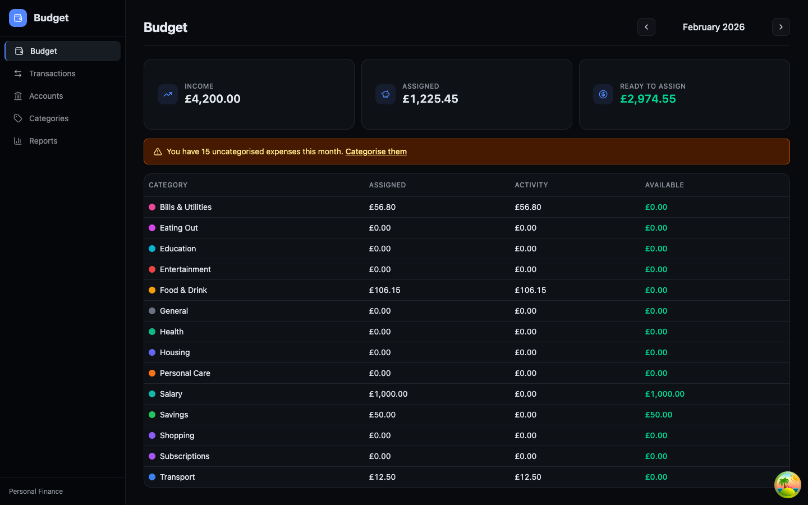
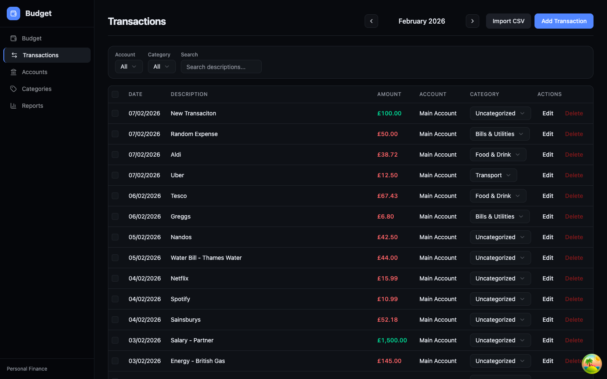
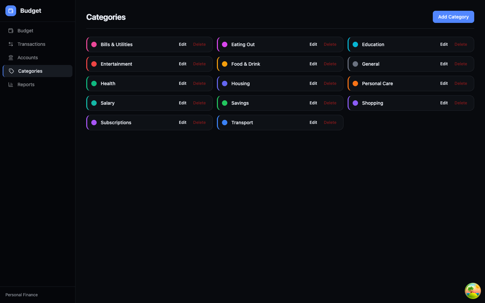
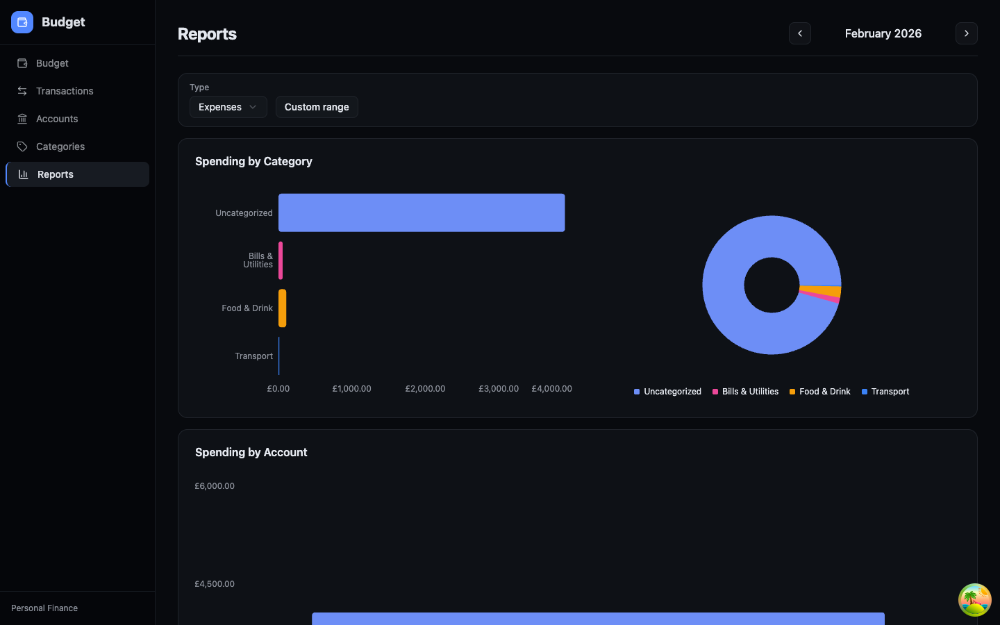
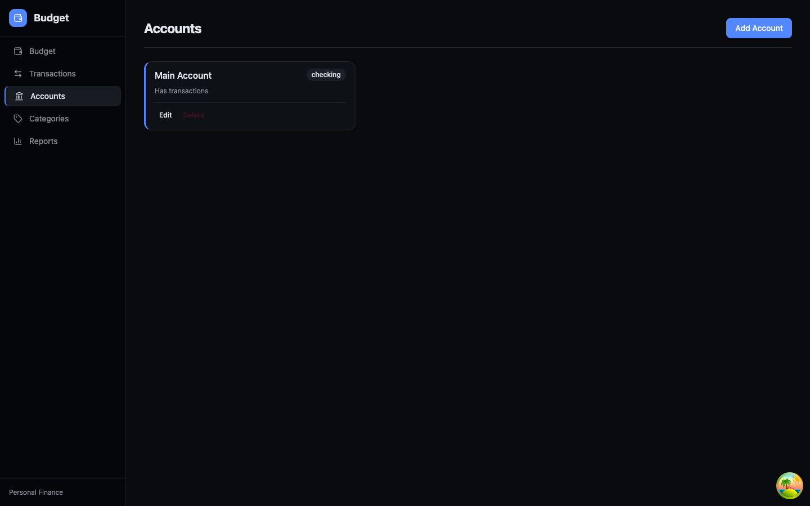

# Budgeting App

A personal budgeting application inspired by YNAB's envelope budgeting method. Track your income and expenses across multiple accounts, categorize transactions, set savings targets, and view spending reports.

## Features

- **Envelope Budgeting** — Assign money to categories each month. Unspent amounts roll over automatically.
- **Category Targets** — Set goals like "save £200/month" or "save £4,000 by January 2027" and see how much you need to assign each month to stay on track.
- **CSV Import** — Import bank transaction CSVs with automatic type detection.
- **Reports** — Spending breakdowns by category and account with interactive charts.
- **Multi-Account** — Track checking, savings, credit, and cash accounts.
- **Quick Actions** — One-click funding for underfunded categories and shortfall coverage.

## Getting Started

### Docker (recommended)

```bash
docker build -t budget-app .
docker run -p 8080:8080 budget-app
```

Then open [http://localhost:8080](http://localhost:8080).

Data is stored in SQLite inside the container. To persist it across restarts, mount a volume:

```bash
docker run -p 8080:8080 -v budget-data:/app/data budget-app
```

### Local Development

**Prerequisites:** [Go](https://go.dev/) 1.24+, [Node.js](https://nodejs.org/) 18+, Make

```bash
# Start both backend (port 8080) and frontend (port 5173)
make dev
```

Then open [http://localhost:5173](http://localhost:5173).

### Building for Production

```bash
make build
```

This produces a Go binary at `dist/server` and static frontend assets in `frontend/dist/`.

### Running Tests

```bash
make test
```

## Tech Stack

| Layer | Technology |
|-------|-----------|
| Backend | Go, Gin, GORM, SQLite |
| Frontend | React, TypeScript, Vite, TailwindCSS v4, shadcn/ui |
| Data Fetching | TanStack React Query |
| Charts | Recharts |
| Routing | React Router |

## Project Structure

```
backend/
  main.go              Entry point and route registration
  config/              Environment configuration
  models/              Database models (Account, Category, Transaction, BudgetAllocation, CategoryTarget)
  handlers/            HTTP request handlers and validation
  services/            Business logic and data access
  database/            Database connection, migrations, and seed data
  testutil/            Test helpers

frontend/
  src/api/client.ts    Typed API client
  src/pages/           Page components (Budget, Transactions, Accounts, Categories, Reports)
  src/components/      Shared components (forms, tables, panels, charts)
  src/components/ui/   shadcn/ui primitives
  src/hooks/           React Query hooks for data fetching and mutations
  src/utils/           Currency formatting and date utilities

sample-data/           Sample CSV files for testing import
```

## Importing Transactions

Go to the **Transactions** page and use the CSV import. Your CSV needs these columns:

| Column | Required | Format |
|--------|----------|--------|
| `date` | Yes | `YYYY-MM-DD` |
| `description` | Yes | Free text |
| `amount` | Yes | Decimal (e.g. `12.50`) |
| `type` | No | `income` or `expense` (inferred from sign if omitted) |

Sample CSVs are included in the `sample-data/` directory.

## Category Targets

Set targets on any category from the budget detail panel. Three types are supported:

- **Monthly Savings** — Assign a fixed amount every month (e.g. £200/month for groceries).
- **Savings Balance** — Accumulate a target balance by a specific month (e.g. £4,000 by Jan 2027). The app calculates how much to assign each month.
- **Spending by Date** — Save up for a one-time expense by a deadline. Same calculation as savings balance.

Targets are versioned — editing or removing a target only affects the current month onward. Past months retain the target that was active at that time.

## Screenshots











## License

Private project.
